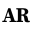

    
    <h1>Asley Robleto</h1>
    
Hi! As you may already know, I'm Asley. I'm a full stack and python developer based in Montréal, Canada.

This repo holds the source code for my personal website. Feel free to use this project as inspiration if you like it enough, I don't have any problem with that.

This page is made using Next typescript, and styled using Tailwind CSS.

<h1>Table of Contents</h1>

- [Hosting](#hosting)
- [License](#license)

## Hosting

The project is hosted on [Render](https://render.com), and you can access it at: [https://asleyrobleto.com](https://asleyrobleto.com).

## License

This project makes use of the GPL-3.0 license.

[❯ Read more about the license here →](LICENSE) 🔏

