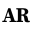
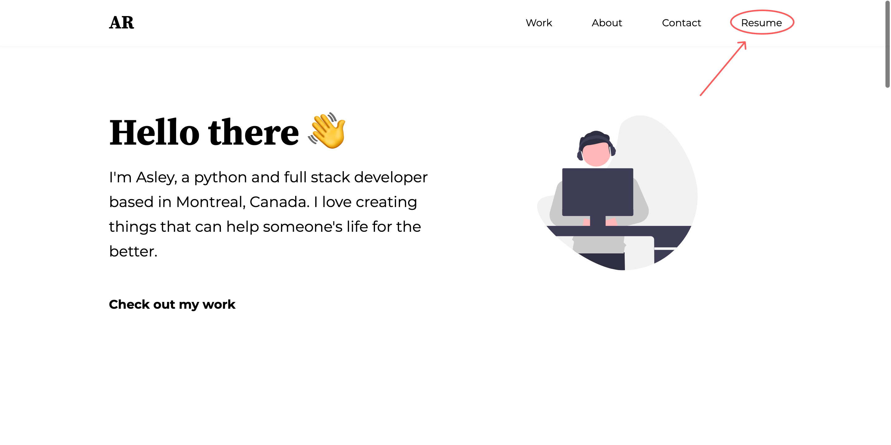

    
    <h1>Asley Robleto</h1>
    
Hi! As you may already know, I'm Asley. I'm a python and full stack developer based in Montreal, Canada.

This repo holds the source code for my personal website. Feel free to use this project as inspiration if you like it enough, I don't have any problem with that.

This page is made using React typescript, and styled using tailwindCSS.

<h1>Table of Contents</h1>

- [Resume](#resume)
- [Hosting](#hosting)
- [License](#license)

## Resume

The website allows users to download a PDF copy of a resume by clicking the `'Resume'` tab found at the header.

The resume that's used is somewhat hard-coded into the `Header.tsx` component, which can be found [here](/src/components/header/Header.tsx). Another resume can be specified by changing the value of the `resumePath` variable found at the Header component. This will make the page to start using the new resume from then on.

By default, the resume that's used is `resume-asleyrobleto.pdf`, and it can be found inside the `public` folder.

## Hosting

The project is hosted on [Render](https://render.com), and you can access it at [asleyrobleto.com](https://asleyrobleto.com).

## License

This project falls under the GPL-3.0 license.

[❯ Read more about the license here →](LICENSE) 🔏

